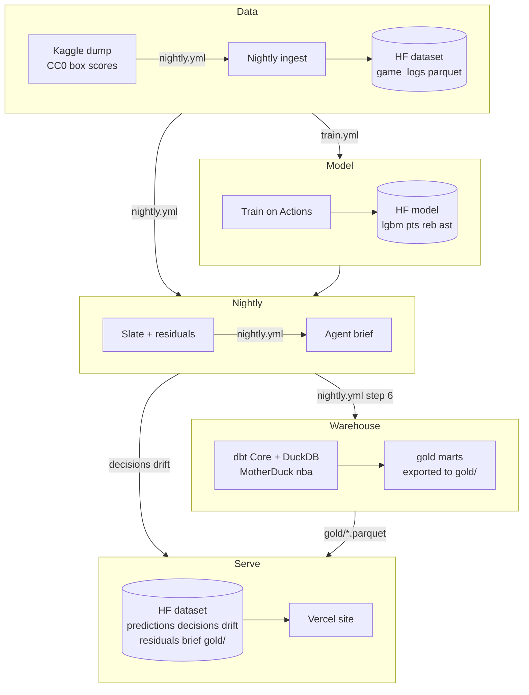

# NBA Stat Predictor

Batch predictions of NBA player points, rebounds, and assists, scored against the next day's box scores and audited by a tool-grounded agent, all on free tiers.

[](https://github.com/cbratkovics/nba-ai-ml/actions/workflows/ci.yml)
[](https://github.com/cbratkovics/nba-ai-ml/actions/workflows/nightly.yml)
[](LICENSE)
[](pyproject.toml)
[](https://nba-ai-ml.vercel.app)

| Live site | HF dataset | HF model | Reconciliation notes | Agent notes |
|:---:|:---:|:---:|:---:|:---:|
| [nba-ai-ml.vercel.app](https://nba-ai-ml.vercel.app) | [cbratkovics/nba-game-logs](https://huggingface.co/datasets/cbratkovics/nba-game-logs) | [cbratkovics/nba-stat-predictor](https://huggingface.co/cbratkovics/nba-stat-predictor) | [docs/reconciliation.md](docs/reconciliation.md) | [docs/agent.md](docs/agent.md) |

## What it does

- **Predict.** One LightGBM regressor per target from a player's games before the target game, evaluated on the full 2025-26 season against the player's last-10-game mean. On the training population (players with at least 10 minutes and both baselines defined), points MAE 4.764 versus 4.908 for that baseline. On all replayed rows the last-10 mean is the better predictor; both populations are reported below and on every page that shows a metric.
- **Validate.** A replay of the nightly slate path over all 164 game dates of 2025-26 reproduces the holdout metrics. Largest MAE difference on the same population: +0.0021 points.
- **Audit.** A Groq-hosted agent reads the published files through seven read-only tools and writes a brief whose every number must match its cited tool output. Grounding on the committed traces: 6 of 6 briefs.

## Architecture


```mermaid
flowchart TB
    subgraph Data
        direction LR
        K[Kaggle dump<br/>CC0 box scores] -->|nightly.yml| I[Nightly ingest]
        I --> D[(HF dataset<br/>game_logs parquet)]
    end
    subgraph Model
        direction LR
        T[Train on Actions] --> M[(HF model<br/>lgbm pts reb ast)]
    end
    subgraph Nightly
        direction LR
        S[Slate + residuals] -->|nightly.yml| A[Agent brief]
    end
    subgraph Serve
        direction LR
        P[(HF dataset<br/>predictions decisions drift<br/>residuals brief gold/)] --> V[Vercel site]
    end
    subgraph Warehouse
        direction LR
        W[dbt Core + DuckDB<br/>MotherDuck nba] --> G[gold marts<br/>exported to gold/]
    end
    Data -->|train.yml| Model
    Data -->|nightly.yml| Nightly
    Model --> Nightly
    Nightly -->|decisions drift| Serve
    Nightly -->|nightly.yml step 6| Warehouse
    Warehouse -->|gold/*.parquet| Serve
```

There is no API server and no database on the serving path: every page fetches the
published files from the Hugging Face dataset repo, and the warehouse builds once per
nightly run upstream of them (its exports land in the same repo as parquet). The agent
tools read those exports too, with the product files as fallback.

| Stage | Where it runs | Cost | Artifact |
|---|---|---|---|
| Ingest from the Kaggle dump | GitHub Actions, 10:00 UTC daily | $0 | `game_logs/<season>.parquet`, `daily_reports/<date>.json` |
| Train and evaluate | GitHub Actions, on dispatch | $0 | `lgbm_{pts,reb,ast}.txt`, `reports/metrics.json` |
| Slate and residuals | GitHub Actions, same nightly job | $0 | `predictions/<date>.parquet`, `residuals/<date>.parquet` |
| Season replay | GitHub Actions, on dispatch | $0 | `reports/replay_2025-26.json`, `replay/2025-26/` |
| Decisions and drift | GitHub Actions, same nightly job | $0 | `decisions/<date>.json`, `decisions/latest.json`, `drift/<date>.json` |
| Agent brief | GitHub Actions, Groq free tier | $0 | `brief/<date>.json`, `brief/latest.json`, trace |
| Site | Vercel, fetch-only pages revalidated hourly | $0 | `/`, `/predictions`, `/replay`, `/decisions`, `/brief` |
| Warehouse (prototyped) | dbt Core + dbt-duckdb; MotherDuck `nba` from the nightly job, local DuckDB in CI and as the fallback | $0 | bronze/silver/gold marts, `gold/*.parquet` in the dataset repo, dbt docs on GitHub Pages |

## Results

Source: [reports/metrics.json](reports/metrics.json) for model `commit 50a3b2e / HF fb427de` (the one identity used everywhere: the git commit of the training code and the Hugging Face revision holding the files; both are pinned in `nba/config.py`). Train on 2021-22 through 2024-25 (88,257 rows), holdout is all of 2025-26 (22,630 rows, 2025-10-21 to 2026-04-12). **Population: rows with at least 10 minutes played, scored on the 22,244 rows where both baselines exist (the training population).** Baselines are the player's last-10-game mean and season-to-date mean.

| Target | Model MAE | Last-10 MAE | Season MAE | Model RMSE | Model R² | Keys in `reports/metrics.json` |
|---|---:|---:|---:|---:|---:|---|
| pts | 4.764 | 4.908 | 4.946 | 6.160 | 0.457 | `metrics.pts.{model,baseline_last10,baseline_season}.mae`, `metrics.pts.model.{rmse,r2}` |
| reb | 1.942 | 2.009 | 2.008 | 2.527 | 0.402 | `metrics.reb.*` |
| ast | 1.431 | 1.460 | 1.456 | 1.909 | 0.461 | `metrics.ast.*` |

The evaluation id is the model identity, `commit 50a3b2e / HF fb427de` (`git_sha` and the
Hugging Face revision in `metrics.json`; `n` = 22,244 for every predictor). The model card,
[docs/MODEL_CARD.md](docs/MODEL_CARD.md), is rendered from this file and the config and is
the canonical statement of what the model is and how it was evaluated; this README quotes
it and never adds a number the artifacts do not carry.

Replay equivalence ([reports/replay_2025-26.json](reports/replay_2025-26.json), keys `mae_restricted.<target>`, `diff_vs_metrics_json.<target>`, `n_restricted` = 22,075): same population, MAE differs from metrics.json by +0.0021 pts, +0.0008 reb, +0.0010 ast, within the 0.05 tolerance. The 169 holdout rows the slate path never produces are why the two are not identical (ADR-0011).

**All rows (replay population).** On every replayed player-game with a box score and a last-10 baseline for every target (26,031 rows over the 164 dates; this includes games under 10 minutes) the last-10 mean has the lower MAE on every target: pts 4.679 vs 4.864, reb 1.939 vs 2.023, ast 1.374 vs 1.403 (row-weighted from [reports/replay_all_rows_2025-26.json](reports/replay_all_rows_2025-26.json), a committed copy of `replay/2025-26/daily_mae.json` at dataset-repo revision `6cbc915b`, keys `days[].model` and `days[].baseline_last10` weighted by `days[].n`; the site reads the derived `frontend/lib/all_rows_baseline.json`, which a test recomputes from that report; the model's all-rows MAE is also `mae_unrestricted` in the committed replay report). The model's edge exists only on the training population; the decision policy below is evaluated on both.

**Decision policy** ([reports/policy_2025-26.json](reports/policy_2025-26.json), keys `populations.<population>.targets.<target>.{threshold,coverage,n_resolved,hit_rate,baselines.season_mean_sign.hit_rate,coverage_curve}`; [docs/DECISIONS.md](docs/DECISIONS.md) ADR-0001, ADR-0006, ADR-0015; prototyped, built locally). A line-free call per player and stat: over when the prediction exceeds the player's last-10 mean by more than a threshold, under when it falls short by more, else no call; a call resolves against the same mean. Thresholds are the largest grid value that still calls 25% of the rows, chosen on the replay rows themselves (in-sample), and the artifact carries the whole coverage curve. Hit rates on resolved calls, against the season-mean sign scored on exactly the same rows (a coin flip is 0.5; where the season-mean sign has no side it is scored as a coin flip and the abstentions are counted in the artifact):

| Population | Points | Rebounds | Assists |
|---|---|---|---|
| Training population (22,075 rows) | 0.667 vs 0.592 at threshold 1.75 (6,680 calls) | 0.660 vs 0.590 at 0.70 (6,516) | 0.633 vs 0.595 at 0.50 (5,914) |
| All rows (26,031 rows) | 0.547 vs 0.566 at 2.25 (6,890) | 0.539 vs 0.566 at 0.90 (6,780) | 0.537 vs 0.564 at 0.50 (8,108) |

On all rows the model's calls hit less often than the season-mean sign on the same rows, so the policy is not recommended there; the site's `/decisions` page says so and the nightly decisions file carries both populations' calls. The warehouse mart `fct_decision_policy` applies the same thresholds to every prediction and two singular tests recompute every number in the artifact.

**Drift monitoring** ([reports/drift_reference_asof_v1_fb427de.json](reports/drift_reference_asof_v1_fb427de.json), [reports/drift_calibration_2025-26.json](reports/drift_calibration_2025-26.json) keys `chosen.threshold`, `false_positives_total`, `positions.<position>.{psi,false_positives}`, `sensitivity`; ADR-0016 to ADR-0018; prototyped). Each night the 14-day window of games before the run date is compared, feature by feature, with a reference built from the gold marts' training rows and aligned by season day (a season-long reference fires on normal data at every position: `games_played_season` alone reached PSI 6.4 during the Cup). Calibrated on the 164 replay dates by season position (opening, Cup, trade-deadline week, All-Star return, April, regular): the chosen rule, HOLD when three or more features have PSI at or above 0.15, fired on none of them; 0.05 would have fired on 69. HOLD opens a labelled issue and never blocks the slate; a run of 14 nights without a schedule file opens a WARN issue. Every run's report goes to `drift/<date>.json` in the dataset repo and to `mart_drift`.

Provenance: [reports/provenance_b20b5601.json](reports/provenance_b20b5601.json) records the SHA-256 of every parquet file at dataset revision `b20b5601`, of the model files and `metrics.json` at HF revision `fb427de`, of the committed reports (including the all-rows file above), and of the replay products the site reads.

Warehouse reconciliation (prototyped: built locally, not yet run in Actions; [docs/DECISIONS.md](docs/DECISIONS.md) ADR-0011): the gold marts recompute the replay's numbers from the residual rows and match `reports/replay_2025-26.json` and `reports/replay_all_rows_2025-26.json` to within 1e-14 with exact row counts, and `reports/metrics.json` to within 0.0022 (the replay never slated 169 of the 22,244 holdout rows). `dbt build`: 24 models, 3 seeds, 1 snapshot, 53 tests.

Agent evals ([reports/agent_evals.json](reports/agent_evals.json) keys `grounding_pass`, `n_briefs`, `golden_pass`, `golden_total`, `golden_facts`; [reports/agent_pass_rates.json](reports/agent_pass_rates.json) key `overall`), model `openai/gpt-oss-120b`:

| Check | Result |
|---|---|
| Grounding: every number in a finding matches its cited tool output within 0.01 | 6 of 6 briefs (23 of 23 findings) |
| Golden set (version 2): a finding names the day's largest-points-residual player, a finding carries the decision policy's hit rate to date, a finding names the drift status | 5 of 5 dates, all three facts each |
| Pass rates over repeated runs (`agent-eval.yml`, 5 per date; row rendered from the report) | <!-- pass-rates -->incomplete: 5 of 25 briefs completed (1 of 5 dates; 0 rate-limited; 4 dates measured under an older golden set, not counted); of those, grounding 5 of 5, golden 5 of 5<!-- /pass-rates -->; see [docs/agent.md](docs/agent.md#reliability) |

<details>
<summary>Running it locally</summary>

```bash
python3.11 -m venv .venv && source .venv/bin/activate
pip install -e ".[dev]"
pytest

python -m nba.storage.hf pull-dataset          # game logs from the HF dataset repo
python -m nba.models.train                     # writes reports/metrics.json
python -m nba.nightly --date 2026-04-12        # ingest, slate, residuals, brief for one date
python -m nba.agent.loop --date 2026-04-12     # brief only; needs GROQ_API_KEY

make dbt-load && make dbt-full && make dbt-docs   # warehouse on a local DuckDB file (dbt/, ADR-0003..0014)
```

LightGBM needs OpenMP at runtime (`brew install libomp` on macOS). Secrets used by the workflows: `HF_TOKEN`, `KAGGLE_USERNAME`, `KAGGLE_KEY`, `GROQ_API_KEY`. Repo ids, the model identity (`MODEL_COMMIT`, `MODEL_REVISION`), the dataset revision, and thresholds live in `nba/config.py`. The dataset and model cards are rendered from that config (`python -m nba.storage.dataset_card`, `python -m nba.models.publish --card-only`); their canonical copies are `docs/DATASET_CARD.md` and `docs/MODEL_CARD.md`.

</details>

## Limitations

- **The model's edge exists on one population.** On the training population (10+ minutes, both baselines defined; 22,244 holdout rows) the model beats the last-10 mean on every target. On all replayed rows (26,031, including games under 10 minutes) the last-10 mean has the lower MAE on every target, and the decision policy's calls hit less often than the season-mean sign on the same rows (0.547 vs 0.566 on points). Every page names its population; the policy is not recommended on all rows (ADR-0002, ADR-0015).
- **Thresholds, bands and the drift rule are in-sample on 2025-26.** The policy's thresholds and residual bands were chosen on the same replay rows they are scored on, and the drift rule (PSI ≥ 0.15 on three features) was calibrated on those 164 dates with zero false positives by construction. The 2026-27 season is the first out-of-sample test of both; a HOLD at its opening is reviewed, not treated as a bug (ADR-0006, ADR-0017, ADR-0018).
- **One data source, lagging, with known gaps.** The Kaggle dump is the only automated source: stats.nba.com is unreachable from GitHub Actions runners (the probe workflow timed out and got HTTP 403), so the pipeline lags the dump's own refresh. Seven 2024-25 games have no box scores in it (1,223 of 1,230; the ids are in docs/reconciliation.md and `list_data_gaps`) and are not filled in from anywhere. If the dump author stops publishing a season's schedule file, no slate can be written; fourteen such nights open a WARN issue (ADR-0018).
- **The agent brief is not deterministic and its pass rates are pending.** At temperature 0 the model's output still varies between runs; a single brief can drop a finding as ungrounded or miss a golden fact. The committed traces replay grounded (6 of 6) and pass every golden fact (5 of 5), but that is one recorded run per date. Pass rates over repeated runs are the measure to read, and under the current golden set none have completed yet: the row above is rendered from the report and says so.
- **Model scope.** One LightGBM regressor per target on 23 rolling and situational features. It does not predict minutes or whether a player plays; a player with no game in their team's previous ten is not slated (169 holdout rows). No injury, lineup or betting-market input; no sportsbook lines anywhere.
- **Prototyped, not yet run in Actions.** The warehouse, the decision policy, drift and the version-2 tools were built and reconciled locally on branch `template`. MotherDuck has never been reached, no drift report or decisions file has been pushed, and the pass-rate spreader has not run under the version-2 golden set. The owner TODO below lists the steps in order.
- **Off-season behaviour.** With no schedule file for the next season, or no games on the date, the nightly job logs one line and exits 0. The drift check reports `insufficient` (no rows in the window), no decisions file is written, and the site's `/predictions` and `/decisions` pages say so.

## Owner TODO (in execution order)

1. Push `template` so CI runs (lint, tests including the trace replay, dbt slim CI on the local target, docs).
2. Create the MotherDuck database `nba` and add `MOTHERDUCK_TOKEN` as a repository secret (ADR-0003, ADR-0007).
3. Dispatch `warehouse.yml` (weekly full refresh) and confirm the MotherDuck build, then `nightly.yml` (writes `drift/<date>.json`, builds the incremental models, exports `gold/`), then `agent-eval.yml` (one golden date per day until the pass-rate row is complete under golden set version 2).
4. Enable GitHub Pages (Settings, Pages, source: GitHub Actions) for the dbt docs.
5. Delete the stale `VERCEL_TOKEN` secret; nothing reads it.
6. Push the regenerated dataset and model cards (`docs/DATASET_CARD.md`, `docs/MODEL_CARD.md`) to Hugging Face after review; the pinned model files and revision are untouched.
7. Merge `template` into `main` (the site deploys from `main`; the slim-CI state is saved on `main` builds).
8. Add the GitHub topics `dbt` and `duckdb` (AUDIT.md §15 item 5).


<details>
<summary>Data-source terms</summary>

- Backfill and daily updates come from [Historical NBA Data and Player Box Scores](https://www.kaggle.com/datasets/eoinamoore/historical-nba-data-and-player-box-scores) by Eoin Moore on Kaggle, released under CC0. The code takes a local path or the Kaggle single-file download with your own credentials; none are stored here.
- The dump is derived from NBA.com box scores. This project uses it for non-commercial personal study, publishes derived per-season Parquet and prediction files on Hugging Face, and does not redistribute the raw CSVs.
- The agent sends Groq only the outputs of its tools, which are aggregates of the published files. No credentials or request headers are recorded in the traces.

</details>

<details>
<summary>Repository layout</summary>

```
nba/
  config.py          seasons, thresholds, HF repo ids, model revision, secrets
  schema.py          canonical game-log schema
  ingest/            kaggle_backfill, kaggle_daily, kaggle_dump rules, schedule
  features/asof.py   point-in-time features
  models/            train, evaluate, publish
  predict/           model loading, slate, residuals, replay
  decisions/         policy rule, artifact writer, nightly decisions
  drift/             PSI, day-aligned reference, check, policy, calibration, nightly runner, notifier
  agent/             tools (over the exported marts), loop, evals, golden, pass_rates
  warehouse/         loader, build gate, gold publisher
  nightly.py         ingest -> residuals -> brief -> slate -> decisions -> drift for one date
frontend/            Next.js pages over the published files
dbt/                 medallion warehouse (bronze/silver/gold, snapshot, seeds, tests, docs overview)
docs/                reconciliation.md, agent.md, DECISIONS.md, DATASET_CARD.md, MODEL_CARD.md
reports/             metrics, replay, policy, drift reference and calibration, provenance, agent evals, golden set, pass rates
docs/STORIES.md      the citable facts per phase with their artifact keys and ADRs
AUDIT.md             read-only audit before the template pass (2026-09-15)
tests/               unit tests and recorded agent traces
.github/workflows/   ci (lint, tests, dbt slim CI, docs to Pages), nightly (+ warehouse step), warehouse (weekly full refresh), train, replay, agent, agent-eval, probe-nba-api
```

</details>

---

Built by Christopher Bratkovics. [Portfolio](https://cbratkovics.dev) · [LinkedIn](https://www.linkedin.com/in/cbratkovics/) · [GitHub](https://github.com/cbratkovics)
