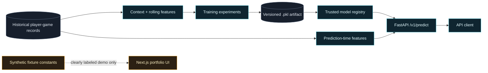

<div align="center">

# COURT VISION

### NBA player-performance forecasting, with an evidence trail.

An applied machine-learning workspace for taking historical player-game context from feature engineering through experimentation, artifact-backed inference, and an interactive portfolio UI.

[Explore the system](#how-the-system-fits-together) · [Run the UI](#run-it-locally) · [Review the evidence contract](docs/PORTFOLIO_EVIDENCE.md)


</div>

---

## What this repository is

Court Vision is a **source-code portfolio and experimentation system**, not a claim of deployed forecasting performance. It contains substantive historical feature pipelines, several experimental model paths, a FastAPI serving layer, and a polished Next.js interface. The UI uses deterministic synthetic fixtures wherever no verified model result is available—and labels them at the point of use.

> [!IMPORTANT]
> **Honest by design.** This checkout does not contain a qualifying benchmark artifact and does not establish forecast accuracy, production traffic, latency, uptime, or deployment status. Missing trusted model artifacts remain errors; they are never replaced by a hidden synthetic prediction.

## What is implemented

| Layer | What exists | What that proves—and does not prove |
| :--- | :--- | :--- |
| **Feature engineering** | Rolling and contextual transformations in `ml/data/processors/feature_engineer.py` and `api/features/player_features.py` | The implementation exists. Prediction-time causality still needs comprehensive evaluation on a defined historical snapshot. |
| **Model experiments** | Random Forest plus RF/XGBoost/LightGBM ensemble implementations | Multiple experiment paths are present. They do not constitute one reproduced benchmark. |
| **Saved-artifact inference** | Registry-backed loading in `ml/serving/predictor_v2.py`, exposed through `/v1/predict` | Serving boundaries are tested. No trusted model binaries are committed here. |
| **Synthetic smoke artifacts** | Deterministic pipeline generation with provenance and SHA-256 hashes | Plumbing can be exercised in isolation. Synthetic rows say nothing about NBA forecast quality. |
| **Portfolio interface** | Responsive Next.js 14 experience under `frontend/` | The checkout can render fixture-driven product states. It is not evidence of a live service. |
| **Operations surfaces** | Monitoring, experiment, registry, and retraining code paths | The code is inspectable. Presence does not establish that those systems have been operated. |

## How the system fits together


```mermaid
flowchart LR
    A[(Historical player-game records)] --> B[Context + rolling features]
    B --> C[Training experiments]
    C --> D[(Versioned .pkl artifact)]
    A --> E[Prediction-time features]
    D --> F[Trusted model registry]
    E --> G[FastAPI /v1/predict]
    F --> G
    G --> H[API client]
    I[Synthetic fixture constants] -. clearly labeled demo only .-> J[Next.js portfolio UI]

    classDef core fill:#0f2530,stroke:#67e8f9,color:#e6fbff;
    classDef store fill:#171f2c,stroke:#64748b,color:#e2e8f0;
    classDef demo fill:#2b2013,stroke:#f59e0b,color:#fef3c7;
    class B,C,E,F,G,H core;
    class A,D store;
    class I,J demo;
```

The repository intentionally keeps three routes distinct:

1. **Historical modeling** — records → feature processors → a selected training script → script-specific artifacts.
2. **Real inference** — player context → prediction-time features → a trusted `models/*.pkl` artifact → `/v1/predict`. If data or an artifact is unavailable, the request fails explicitly.
3. **Portfolio fixtures** — deterministic constants → labeled example cards. This route bypasses the prediction API and has no model-quality meaning.

The Random Forest serving convention and the multi-library Bayesian-ridge stack are separate implementations. A Random Forest is itself an ensemble of trees, but it is not therefore the RF/XGBoost/LightGBM stack.

## Run it locally

### Interface — zero credentials required

Prerequisite: Node.js 18+.

```bash
git clone https://github.com/cbratkovics/nba-ai-ml.git
cd nba-ai-ml/frontend
npm ci
npm run dev
```

Open **http://localhost:3000**. The interface is a fixture demonstration and does not require a database, Redis, an NBA API connection, or paid credentials.

### API — real data and trusted artifacts

Prerequisite: Python 3.10+.

```bash
python -m venv .venv
source .venv/bin/activate
pip install -r requirements.txt
uvicorn api.main:app --reload
```

| Variable | Requirement | Purpose |
| :--- | :--- | :--- |
| `DATABASE_URL` | Required for database-backed features | Historical/player feature access |
| `REDIS_URL` | Optional | Prediction caching; inference runs uncached without it |
| `CLERK_SECRET_KEY` | Optional for anonymous demo-tier requests | Clerk bearer-token validation |

The liveness endpoint establishes process health, **not model readiness**. Historical collection and training scripts may call external services, write data, or replace script-specific outputs; inspect the selected script and choose an isolated output first.

### Provenance-aware synthetic smoke check

```bash
python scripts/create_dummy_model.py \
  --output-dir /tmp/nba-synthetic-artifacts \
  --samples 40
```

The generator refuses an output directory named `models` and a non-empty destination unless `--overwrite` is explicit. Its `provenance.json` records the source kind, command, seed, timestamp, feature order, preprocessing, source commit/dirty state, and artifact hashes.

## Evidence before accuracy

A publishable evaluation must identify:

- dataset and input hash, date range, and inclusion rules;
- chronological train/validation/test boundaries and forecast horizon;
- feature contract, preprocessing identity, model configuration, and artifact hash;
- seed, dependency versions, per-target denominators, and a causal baseline;
- metric definitions, reproduction command, commit, and dirty state.

MAE and RMSE belong in the target unit (points, rebounds, or assists). R² is a dimensionless coefficient—not “percent accuracy.” A heuristic range or model disagreement is not a calibrated prediction interval without held-out coverage evidence. Until an eligible evaluation is committed, the dashboard correctly renders an unavailable state.

Read the complete [portfolio evidence ledger](docs/PORTFOLIO_EVIDENCE.md) for route-level limitations and external follow-ups.

## Verification

```bash
pytest -q tests/test_provenance_contract.py
cd frontend && npm run lint
cd frontend && npm run build
cd dashboard && npm run build
python -m compileall api ml scripts/create_dummy_model.py
```

## Repository map

```text
api/          FastAPI routes, schemas, features, and optional services
ml/           Feature processing, experiments, evaluation, and serving
database/     SQLAlchemy models and Alembic migrations
frontend/     Maintained Next.js portfolio interface
dashboard/    Legacy Create React App interface, labeled in-app
monitoring/   Optional monitoring service paths
scripts/      Ingestion, training, validation, and smoke tooling
docs/         Architecture notes and the evidence ledger
```

## Deployment boundary

`Dockerfile` and `railway.json` are deployment **templates** for the FastAPI container and `/health` liveness probe. They are not proof that a current public service has been deployed or inspected. An authorized operator must separately deploy, verify readiness, exercise artifact-backed inference, and inspect responsive and failure states before making any operational claim.

---

<div align="center"><sub>Built to make the modeling inspectable—and choose “unavailable” over an unsupported number.</sub></div>
